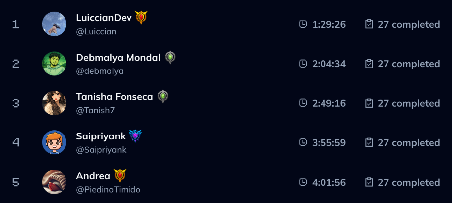

[Day 28 challenge](https://www.codedex.io/daily-challenge/2026-03-29)

You’ve been grinding Daily Challenges, and now it’s time to analyze progress.

On the All-Time leaderboard, you might see summaries like:

But raw strings aren’t very helpful – let’s turn this into something meaningful.

Your task? Given two pieces of a user's data:

The total time spent on challenges, in the format "H:MM:SS"
The number of challenges completed
Convert the total time into seconds and calculate the average time per challenge.

Return the average time per challenge (rounded to the nearest second). ⏱️

Examples

@gntalan

- Inputs:
total = "1:41:29"
completed = 26
- Output: 234

@gntalan's average is 234 seconds.

@calcite

Inputs:
- total = "10:49:08"
completed = 27
- Output: 1443

@calcite's average is 1443 seconds.